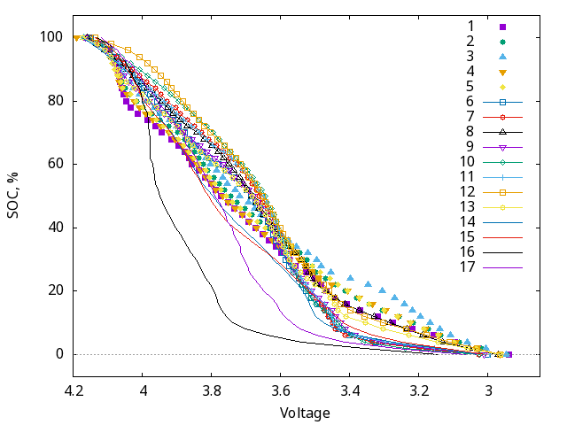
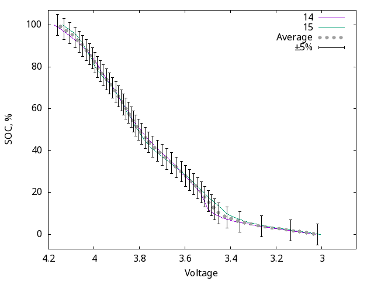
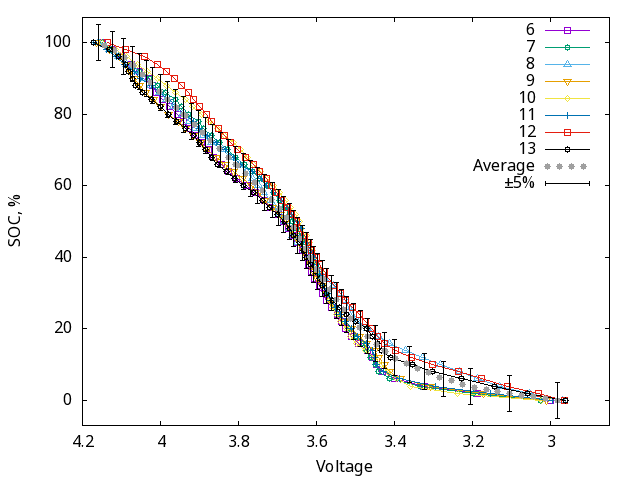
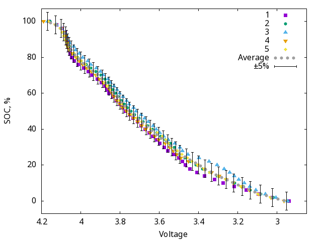

# Experimental voltage–state-of-charge data for lithium-ion cells

This repository contains experimentally measured discharge curves for cylindrical lithium-ion cells, together with a small header-only C library for estimating state of charge (SOC) from cell voltage.

I collected these data for battery-powered Home Assistant projects where an SOC estimate within approximately ±5 percentage points was sufficient. Publicly available voltage–SOC tables have low resolution, often published only as raster images. Also, there are several conflicting tables exist for the same Li-Ion cell type (and there is a reason for that, see below). The numerical data in this repository are intended to provide a more useful starting point for similar low-current applications.

Most of the tested cells are 18650 cells. The set also includes one 21700 cell: Lishen LR2170LA. Some cells were purchased new, while others were reclaimed from power-tool battery packs. See the [cell list](cell_list.md) for photographs and nominal and measured capacities.


## Header-only C library

[`src/liion.h`](src/liion.h) provides voltage–SOC tables for identified cells and for the three capacity groups. Each table contains 51 `uint16_t` voltage values in millivolts, ordered from 0% to 100% SOC. A table occupies 102 bytes and is declared `const` so that embedded toolchains can normally place it in read-only memory.

The `voltage_to_soc()` function accepts cell voltage in millivolts, interpolates between adjacent entries, and clamps voltages outside the table range to empty or full.

Select a table by defining `SOC_TABLE` before including the header:

```c
#define SOC_TABLE soc_molicel_3500
#include "src/liion.h"

uint16_t soc = voltage_to_soc(3700);
```

If `SOC_TABLE` is not defined, `soc_cap_2` is selected.

The library currently defines `PERCENTAGE_MULTIPLIER` as 2 for compatibility with the Zigbee Power Configuration cluster. Consequently, `voltage_to_soc()` returns values from 0 to 200, in half-percentage-point units. Redefine `PERCENTAGE_MULTIPLIER` to fit your needs.

Because the tables have internal linkage in a header, an unoptimized program may retain multiple tables or create a copy in each translation unit that includes the file. On memory-constrained targets, enable optimization, include the header from only one translation unit where practical, and inspect the final linker map.


## Measurement and processing

The cells were discharged at 200 mA using an Opus BT-C3100 charger. Cell voltage under load was recorded with a separate voltage logger. The raw measurements are stored in [`raw_data/`](raw_data):

- Column 1: elapsed time, in seconds
- Column 2: measured cell voltage, in volts

Some cells were tested more than once; repeated runs have suffixes such as `_2` and `_3`.

The processing scripts apply a 20 mV voltage correction and a 600-second moving-average filter. SOC is derived from elapsed discharge time under the assumed constant 200 mA current and normalized so that the beginning and end of each run correspond to SOC values of 1.0 and 0.0. Where multiple runs exist for one cell, their voltage values are averaged at equal SOC intervals.

The processed curves are stored in [`discharge/`](discharge). Each file contains 51 rows at 2-percentage-point SOC intervals:

- Column 1: SOC fraction, from 1.000 to 0.000
- Column 2: cell voltage, in volts

Files `01.dat` through `17.dat` correspond to the numbered entries in the [cell list](cell_list.md). Files named `soc_type1.dat`, `soc_type2.dat`, and `soc_type3.dat` contain group-averaged curves.


## Important limitations

Terminal voltage is not a unique measure of SOC. It also depends on load current, temperature, cell age, recent charge or discharge history, internal resistance, and relaxation time. These curves are therefore most applicable to conditions similar to the tests: low-current discharge at approximately 200 mA.

The group averages describe only the cells tested here. A cell with a similar capacity is not guaranteed to follow the same curve.

## Cell grouping by discharge-curve shape

Many of the tested cells have similarly shaped voltage–SOC curves despite differences in manufacturer. The cells were grouped primarily by measured capacity:

- `soc_type1.dat`: up to approximately 1,500 mAh
- `soc_type2.dat`: above 1,500 mAh and up to approximately 2,500 mAh
- `soc_type3.dat`: above approximately 2,500 mAh

Cells 16 and 17 are outliers and are not included in any group until I am able to test more cells similar to those two.



The following plots compare the individual curves with their group average. The error bars show ±5% SOC. 







Most measured curves remain within approximately ±5 percentage points of their group average over much of the discharge range. This is agreement within the tested sample, not a claim of absolute SOC accuracy for other cells.


Based on this grouping principle, these are the available group-average tables in the library:

| Table | Approximate measured-capacity range |
| --- | --- |
| `soc_cap_1` | Up to 1,500 mAh |
| `soc_cap_2` | Above 1,500 mAh and up to 2,500 mAh |
| `soc_cap_3` | Above 2,500 mAh |

Available individual-cell tables are:

| Cell number | Table |
| --- | --- |
| 1 | `soc_eve_3500` |
| 2 | `soc_lishen_3950` |
| 3 | `soc_molicel_3500` |
| 4 | `soc_samsung_3000` |
| 5 | `soc_vapcell_3000` |
| 6 | `soc_bfn_2200` |
| 7 | `soc_eve_2000` |
| 8 | `soc_LG_2500` |
| 11 | `soc_samsung_2000` |
| 13 | `soc_samsung_2500` |
| 14 | `soc_LG_1300` |
| 15 | `soc_SE_1600` |
| 16 | `soc_cj_1500` |

The capacity shown in an individual table name is the cell's nominal capacity, not necessarily its measured capacity. Duplicate cells and cells whose nominal capacity is unknown are omitted from the library.


## License

The code and experimental data in this repository are provided under the [BSD 2-Clause License](LICENSE).
